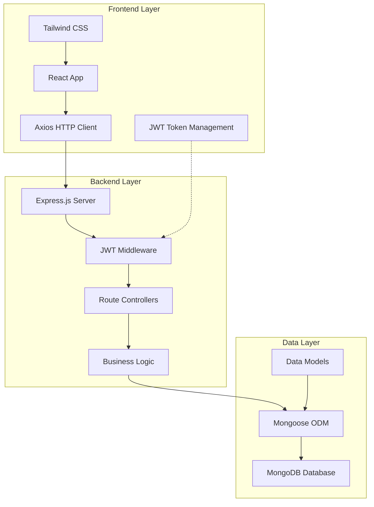

# Design Document

## Overview

The Employee Payroll & Salary Processing System is a full-stack MERN application that provides comprehensive payroll management capabilities with role-based access control. The system follows a three-tier architecture with a React frontend, Node.js/Express backend, and MongoDB database. The design emphasizes security through JWT authentication, data integrity through proper schema design, and user experience through responsive UI components.

## Architecture

### System Architecture



### Technology Stack

**Frontend:**
- React 18+ for component-based UI development
- Tailwind CSS for utility-first styling and responsive design
- Axios for HTTP client communication
- React Router for client-side routing and protected routes

**Backend:**
- Node.js runtime environment
- Express.js web framework for RESTful API development
- JWT (jsonwebtoken) for stateless authentication
- bcryptjs for password hashing and security
- Mongoose ODM for MongoDB object modeling

**Database:**
- MongoDB for document-based data storage
- Optimized schema design for payroll operations
- Indexing on frequently queried fields

## Components and Interfaces

### Backend Components

#### Authentication Service
- **Purpose**: Handles user registration, login, and JWT token management
- **Key Methods**:
  - `register(userData)`: Creates new user with hashed password
  - `login(credentials)`: Validates credentials and returns JWT token
  - `verifyToken(token)`: Validates JWT token and extracts user information

#### Employee Service
- **Purpose**: Manages employee CRUD operations and data validation
- **Key Methods**:
  - `createEmployee(employeeData)`: Creates new employee record
  - `getAllEmployees()`: Retrieves all employee records with user information
  - `updateEmployee(id, updateData)`: Updates existing employee information
  - `getEmployeeById(id)`: Retrieves specific employee details

#### Payroll Service
- **Purpose**: Handles salary calculations and payroll record management
- **Key Methods**:
  - `calculateSalary(employee)`: Computes gross and net salary
  - `runPayrollForAll(month, year)`: Processes payroll for all employees
  - `getPayrollHistory(employeeId)`: Retrieves employee payroll records

#### Middleware Components
- **Authentication Middleware**: Validates JWT tokens on protected routes
- **Authorization Middleware**: Enforces role-based access control
- **Error Handling Middleware**: Provides consistent error responses
- **Validation Middleware**: Validates request data against schemas

### Frontend Components

#### Authentication Components
- **LoginForm**: User login interface with form validation
- **RegisterForm**: User registration interface with role selection
- **ProtectedRoute**: Route wrapper for authentication checks

#### Admin Dashboard Components
- **AdminLayout**: Main layout with navigation and sidebar
- **EmployeeList**: Table displaying all employees with actions
- **EmployeeForm**: Form for adding/editing employee information
- **PayrollRunner**: Interface for triggering payroll processing
- **PayrollHistory**: Admin view of all payroll records

#### Employee Dashboard Components
- **EmployeeLayout**: Employee-specific layout and navigation
- **PayslipView**: Display individual payslip information
- **PayrollHistory**: Employee's personal payroll history

#### Shared Components
- **Header**: Navigation bar with user information and logout
- **Sidebar**: Role-based navigation menu
- **LoadingSpinner**: Loading state indicator
- **ErrorMessage**: Error display component
- **SuccessMessage**: Success notification component

### API Interface Design

#### Authentication Endpoints
```
POST /api/auth/register
Body: { name, email, password, role }
Response: { success, message, user }

POST /api/auth/login
Body: { email, password }
Response: { success, token, user }
```

#### Employee Management Endpoints
```
POST /api/employee/add (Admin only)
Body: { userId, baseSalary, allowance, deduction }
Response: { success, employee }

GET /api/employee (Admin only)
Response: { success, employees[] }

PUT /api/employee/:id (Admin only)
Body: { baseSalary, allowance, deduction }
Response: { success, employee }
```

#### Payroll Endpoints
```
POST /api/payroll/run (Admin only)
Body: { month, year }
Response: { success, processedCount, results[] }

GET /api/payroll/:employeeId
Response: { success, payrollRecords[] }
```

## Data Models

### User Model
```javascript
{
  _id: ObjectId,
  name: String (required, trim),
  email: String (required, unique, lowercase),
  password: String (required, hashed),
  role: String (enum: ['admin', 'employee'], default: 'employee'),
  createdAt: Date (default: Date.now),
  updatedAt: Date (default: Date.now)
}
```

### Employee Model
```javascript
{
  _id: ObjectId,
  userId: ObjectId (ref: 'User', required, unique),
  baseSalary: Number (required, min: 0),
  allowance: Number (default: 0, min: 0),
  deduction: Number (default: 0, min: 0),
  createdAt: Date (default: Date.now),
  updatedAt: Date (default: Date.now)
}
```

### Payroll Model
```javascript
{
  _id: ObjectId,
  employeeId: ObjectId (ref: 'Employee', required),
  month: Number (required, min: 1, max: 12),
  year: Number (required, min: 2020),
  baseSalary: Number (required),
  allowance: Number (required),
  deduction: Number (required),
  grossSalary: Number (required),
  netSalary: Number (required),
  createdAt: Date (default: Date.now)
}
```

### Database Indexes
- User: `{ email: 1 }` (unique index for login performance)
- Employee: `{ userId: 1 }` (unique index for user-employee relationship)
- Payroll: `{ employeeId: 1, year: -1, month: -1 }` (compound index for payroll queries)

## Correctness Properties

*A property is a characteristic or behavior that should hold true across all valid executions of a system-essentially, a formal statement about what the system should do. Properties serve as the bridge between human-readable specifications and machine-verifiable correctness guarantees.*

### Authentication and Authorization Properties

**Property 1: User Registration Correctness**
*For any* valid user registration data (name, email, password, role), the system should create a user record with the specified role and hashed password
**Validates: Requirements 1.1**

**Property 2: JWT Token Generation**
*For any* valid login credentials, the authentication service should return a JWT token containing the correct user information and role
**Validates: Requirements 1.2**

**Property 3: Invalid Token Rejection**
*For any* invalid or malformed JWT token, the system should reject the request and return an authentication error
**Validates: Requirements 1.3**

**Property 4: Role-Based Access Control**
*For any* admin-only endpoint and employee JWT token, the system should deny access and return an authorization error
**Validates: Requirements 1.4**

**Property 5: Password Security**
*For any* user registration, the stored password should be hashed and never stored in plain text
**Validates: Requirements 5.4**

### Employee Management Properties

**Property 6: Employee Creation Integrity**
*For any* valid employee data with admin authentication, the system should create an employee record properly linked to the user account
**Validates: Requirements 2.1**

**Property 7: Employee List Completeness**
*For any* admin request for employee list, the system should return all existing employee records with their associated user information
**Validates: Requirements 2.2**

**Property 8: Employee Update Correctness**
*For any* valid employee update data with admin authentication, the system should modify only the specified fields of the existing employee record
**Validates: Requirements 2.3**

**Property 9: Employee Data Validation**
*For any* invalid employee data (negative salaries, missing required fields), the system should reject the request and return specific validation errors
**Validates: Requirements 2.4**

### Payroll Calculation Properties

**Property 10: Salary Calculation Correctness**
*For any* employee with base salary, allowance, and deduction values, the payroll engine should calculate gross salary as (base + allowance) and net salary as (gross - deduction)
**Validates: Requirements 3.2, 3.3**

**Property 11: Payroll Processing Completeness**
*For any* payroll run request, the system should create payroll records for all existing employees with complete calculation details
**Validates: Requirements 3.1, 3.4**

**Property 12: Payroll Error Isolation**
*For any* payroll processing batch where some employees have invalid data, the system should continue processing valid employees and report specific errors for invalid ones
**Validates: Requirements 3.5**

### Data Access and Security Properties

**Property 13: Payroll Data Isolation**
*For any* employee requesting payroll data, the system should return only their own payroll records and deny access to other employees' data
**Validates: Requirements 4.1, 4.3**

**Property 14: Payroll Display Completeness**
*For any* payroll record display, the system should include all required fields: month, year, base salary, allowance, deductions, gross salary, and net salary
**Validates: Requirements 4.2**

**Property 15: Payroll Record Ordering**
*For any* payroll history request, the system should return records ordered by date with most recent first
**Validates: Requirements 4.5**

**Property 16: Referential Integrity**
*For any* database operation involving users, employees, and payroll records, all references should remain valid and consistent
**Validates: Requirements 5.5**

### Frontend Integration Properties

**Property 17: Role-Based Dashboard Display**
*For any* user login, the frontend should display the appropriate dashboard (admin or employee) based on the user's role
**Validates: Requirements 7.2, 7.3**

**Property 18: Authenticated Request Headers**
*For any* API request from authenticated users, the request should include a valid JWT token in the authorization header
**Validates: Requirements 7.4, 8.2**

**Property 19: Route Protection**
*For any* protected route access without valid authentication, the frontend should redirect to login and prevent unauthorized access
**Validates: Requirements 7.7**

**Property 20: Error Handling Consistency**
*For any* authentication failure or network error, the frontend should display appropriate user-friendly error messages
**Validates: Requirements 7.6, 8.5**

**Property 21: API Response Handling**
*For any* API response (success or error), the frontend should handle the response appropriately and update the UI state
**Validates: Requirements 8.3**

**Property 22: JSON Communication Format**
*For any* API request or response, the system should use JSON format for all data payloads
**Validates: Requirements 8.4**

Now I need to analyze the acceptance criteria to determine which ones can be tested as properties:

<function_calls>
<invoke name="prework">
<parameter name="featureName">employee-payroll-system

## Error Handling

### Backend Error Handling Strategy

**Authentication Errors:**
- Invalid credentials: Return 401 with descriptive message
- Missing/invalid JWT tokens: Return 401 with authentication required message
- Expired tokens: Return 401 with token expired message
- Insufficient permissions: Return 403 with authorization denied message

**Validation Errors:**
- Invalid input data: Return 400 with field-specific validation messages
- Missing required fields: Return 400 with list of missing fields
- Data type mismatches: Return 400 with expected format information
- Business rule violations: Return 422 with business logic error details

**Database Errors:**
- Connection failures: Return 503 with service unavailable message
- Duplicate key violations: Return 409 with conflict details
- Reference integrity violations: Return 400 with relationship error details
- Query timeouts: Return 504 with timeout message

**Server Errors:**
- Unexpected exceptions: Return 500 with generic error message (log detailed error)
- Service unavailable: Return 503 with retry information
- Rate limiting: Return 429 with retry-after header

### Frontend Error Handling Strategy

**Network Errors:**
- Connection timeouts: Display "Connection timeout, please try again"
- Network unavailable: Display "Network error, check your connection"
- Server errors (5xx): Display "Server error, please try again later"

**Authentication Errors:**
- Invalid login: Display "Invalid email or password"
- Session expired: Redirect to login with "Session expired, please log in again"
- Access denied: Display "You don't have permission to access this resource"

**Validation Errors:**
- Form validation: Display field-specific error messages inline
- API validation: Display server validation messages near relevant fields
- Required fields: Highlight missing fields with clear error text

**User Experience Errors:**
- Loading states: Show spinners during API calls
- Empty states: Display helpful messages when no data exists
- Retry mechanisms: Provide retry buttons for failed operations

### Error Logging and Monitoring

**Backend Logging:**
- Log all authentication failures with IP addresses
- Log all authorization violations with user details
- Log all database errors with query context
- Log all unexpected exceptions with full stack traces

**Frontend Error Tracking:**
- Track JavaScript errors and API failures
- Monitor user interaction errors and form submission failures
- Collect performance metrics for slow operations

## Testing Strategy

### Dual Testing Approach

The system will employ both unit testing and property-based testing to ensure comprehensive coverage and correctness validation.

**Unit Tests:**
- Verify specific examples and edge cases
- Test integration points between components
- Validate error conditions and boundary cases
- Focus on concrete scenarios and known use cases

**Property-Based Tests:**
- Verify universal properties across all inputs
- Test system behavior with randomized data
- Validate correctness properties from the design document
- Ensure comprehensive input coverage through automated generation

### Property-Based Testing Configuration

**Testing Framework:** Jest with fast-check library for property-based testing
**Test Configuration:**
- Minimum 100 iterations per property test
- Each property test references its design document property
- Tag format: **Feature: employee-payroll-system, Property {number}: {property_text}**

**Property Test Categories:**

1. **Authentication Properties (Properties 1-5):**
   - Generate random user data for registration testing
   - Create invalid tokens for rejection testing
   - Test role-based access across all admin endpoints

2. **Employee Management Properties (Properties 6-9):**
   - Generate random employee data for CRUD operations
   - Test validation with invalid salary values and missing fields
   - Verify data integrity across all employee operations

3. **Payroll Calculation Properties (Properties 10-12):**
   - Generate random salary combinations for calculation testing
   - Test batch processing with mixed valid/invalid employee data
   - Verify mathematical correctness across all possible inputs

4. **Data Access Properties (Properties 13-16):**
   - Test data isolation with multiple employee accounts
   - Verify referential integrity across all database operations
   - Test ordering and completeness of payroll records

5. **Frontend Integration Properties (Properties 17-22):**
   - Test role-based UI behavior with different user types
   - Verify API communication patterns and error handling
   - Test route protection and authentication flows

### Unit Testing Strategy

**Backend Unit Tests:**
- Test individual service methods with specific inputs
- Mock database operations for isolated testing
- Test middleware functions with various request scenarios
- Validate API endpoint responses for known inputs

**Frontend Unit Tests:**
- Test React components with specific props and state
- Test user interactions and form submissions
- Test API integration with mocked responses
- Test routing and authentication logic

**Integration Tests:**
- Test complete API workflows from request to response
- Test database operations with real MongoDB test instance
- Test frontend-backend communication with test server
- Test authentication flows end-to-end

### Test Data Management

**Test Database:**
- Use separate MongoDB test database
- Reset database state between test suites
- Use factory functions for consistent test data generation
- Implement database seeding for integration tests

**Mock Data Generation:**
- Create realistic user and employee data generators
- Generate valid and invalid payroll scenarios
- Use property-based testing generators for comprehensive coverage
- Maintain test data consistency across test suites

### Continuous Testing

**Automated Testing Pipeline:**
- Run all tests on every code commit
- Generate test coverage reports
- Run property-based tests with extended iterations in CI/CD
- Monitor test performance and execution time

**Test Coverage Goals:**
- Minimum 90% code coverage for backend services
- Minimum 85% code coverage for frontend components
- 100% coverage of all correctness properties
- Complete coverage of all API endpoints and error scenarios