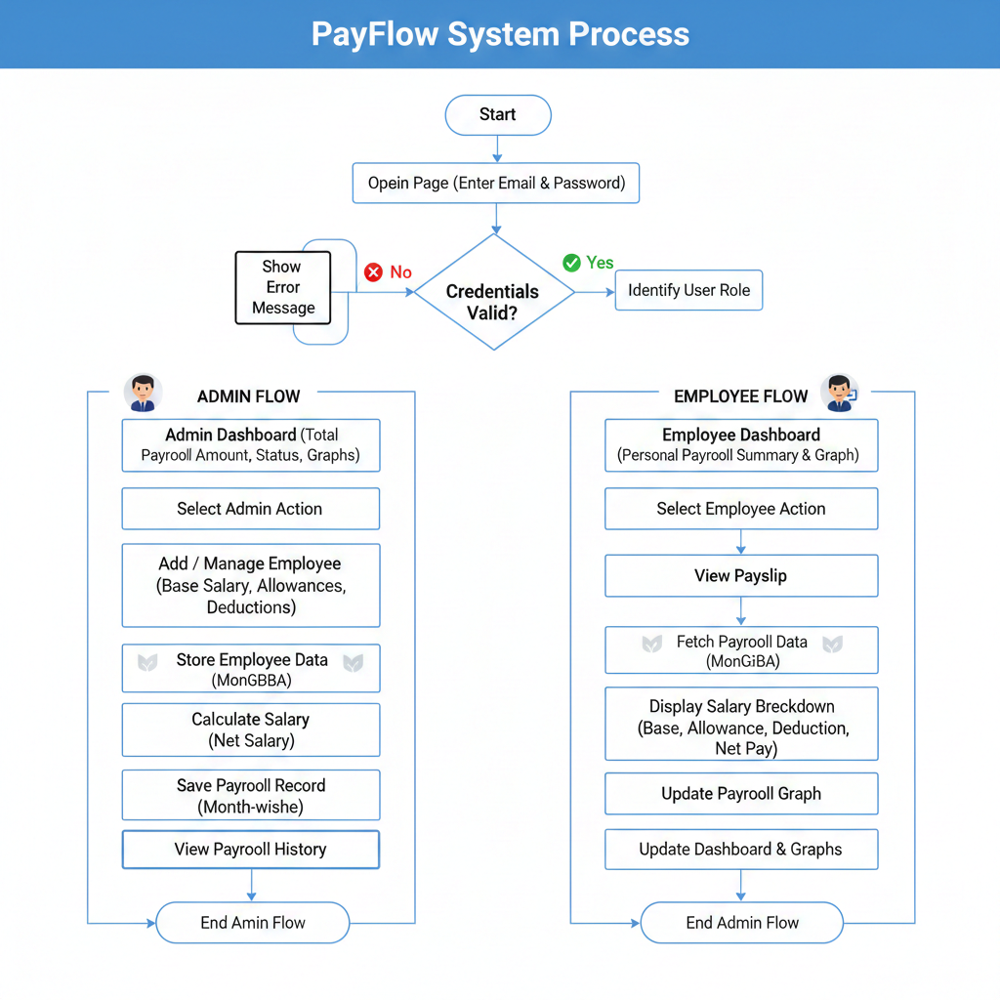

# PayFlow - Employee Payroll System

A comprehensive MERN stack application for managing employee payroll with role-based access control.

## Project Structure

```
payflow/
├── backend/                 # Node.js/Express API server
│   ├── src/
│   │   ├── models/         # Database models
│   │   ├── routes/         # API routes
│   │   ├── middleware/     # Custom middleware
│   │   ├── services/       # Business logic
│   │   └── utils/          # Utility functions
│   ├── server.js           # Main server file
│   ├── package.json        # Backend dependencies
│   └── jest.config.js      # Jest configuration
├── frontend/payroll-frontend/  # React frontend (PayFlow UI)
    ├── src/
    │   ├── components/     # React components
    │   ├── pages/          # Page components
    │   ├── services/       # API services
    │   ├── utils/          # Utility functions
    │   └── hooks/          # Custom React hooks
    ├── package.json        # Frontend dependencies
    ├── tailwind.config.js  # Tailwind CSS configuration
    └── jest.config.js      # Jest configuration
```

## Technology Stack

### Backend
- **Node.js** - Runtime environment
- **Express.js** - Web framework
- **MongoDB** - Database
- **Mongoose** - ODM for MongoDB
- **JWT** - Authentication
- **bcryptjs** - Password hashing
- **Jest** - Testing framework
- **fast-check** - Property-based testing

### Frontend
- **React 18** - UI library
- **Vite** - Build tool
- **Tailwind CSS** - Styling
- **Axios** - HTTP client
- **React Router** - Routing
- **Jest** - Testing framework
- **@testing-library/react** - React testing utilities

## Features

- **User Authentication**: JWT-based authentication with role-based access
- **Employee Management**: CRUD operations for employee records (Admin only)
- **Payroll Processing**: Automated salary calculations and payroll generation
- **Payroll History**: View payroll records with proper access control
- **Responsive Design**: Clean, professional UI with Tailwind CSS
- **Property-Based Testing**: Comprehensive testing with fast-check library

## Roles
- Admin: Manage employees, run payroll, view all payroll records
- Employee: View personal payroll history and payslips

## Limitations
- Payroll processing is simulated (no real payment gateway)
- Designed for small to medium organizations

## Project Workflow
<p align="center">
  
</p>

  
## Getting Started

### Prerequisites
- Node.js (v18 or higher)
- MongoDB (local)
- npm 

### Backend Setup
```bash
cd backend
npm install
npm run dev
```

### Frontend Setup
```bash
cd frontend/payroll-frontend
npm install
npm run dev
```


## API Endpoints

### Authentication
- `POST /api/auth/register` - User registration
- `POST /api/auth/login` - User login

### Employee Management (Admin only)
- `POST /api/employee/add` - Add new employee
- `GET /api/employee` - Get all employees
- `PUT /api/employee/:id` - Update employee

### Payroll
- `POST /api/payroll/run` - Run payroll processing (Admin only)
- `GET /api/payroll/:employeeId` - Get employee payroll history

## Testing

### Backend Tests
```bash
cd backend
npm test
npm run test:watch
```

### Frontend Tests
```bash
cd frontend/payroll-frontend
npm test
npm run test:watch
```


